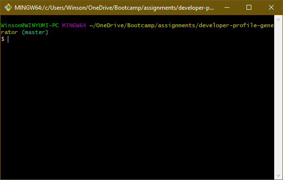

# Developer Profile Generator

## Introduction

Want a quick and easy way to create a document showcasing a person's GitHub profile? Use this command-line application to generate one in PDF format for easy printing and sharing!

## Installation

Download or clone this repository into your local computer. **Node.js** is required in order to run this script.

## Usage

1. In your terminal, run the script with the command `node index.js`.
2. Enter a GitHub username when prompted. It may take a moment.
3. Choose a color theme for your PDF.
4. Your PDF will be generated in the `pdf/` folder.

## Output

